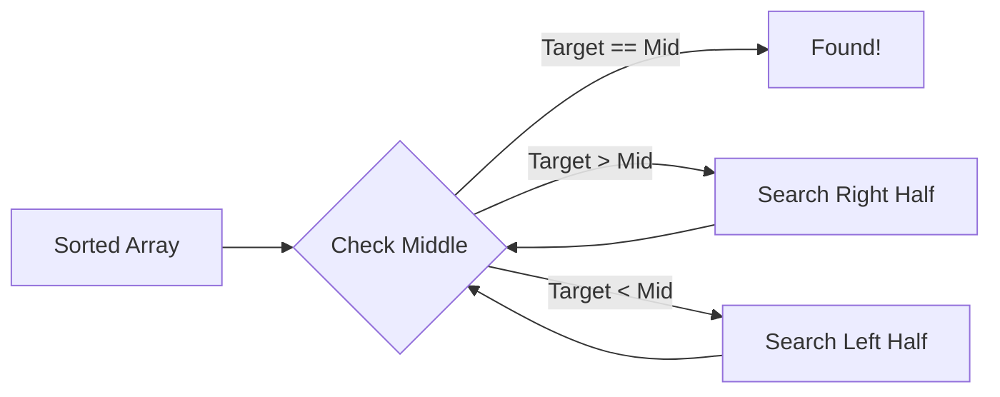

# ⚔️ Binary Search: The Art of Halving the Search Space

> **"Binary search is deceptively simple: the core idea of halving the search space is intuitive... but implementing it correctly is notoriously difficult."**



## Why This Chapter Matters

Binary search is the **single most important algorithm** you need to master for coding interviews. All 21 problems from our CrackGoogle repository are covered below with solutions in Kotlin, Java, Python, Rust, and C++.

### The Infamous Bug Story

Even **Donald Knuth** said binary search details are "surprisingly tricky." Java's standard library had an integer overflow bug for **over 20 years** using `(low + high) / 2` instead of `low + (high - low) / 2`.

## The Core Pattern

Safe midpoint: `mid = left + (right - left) / 2`

| Condition | Use Case |
|-----------|----------|
| `left <= right` | Exact value search |
| `left < right` | Boundary search |
| `left + 1 < right` | Avoiding infinite loops |

---

## Complete Binary Search Arsenal - 21 Problems

| # | Problem | Pattern | Difficulty |
|---|---------|---------|------------|
| 1 | Classic Binary Search | Exact Search | Easy |
| 2 | Search Insert Position | Lower Bound | Easy |
| 3 | First Bad Version | Lower Bound | Easy |
| 4 | Guess Number Higher or Lower | Exact Search | Easy |
| 5 | Peak in Mountain Array | Local Peak | Easy |
| 6 | Find Peak Element | Local Peak | Medium |
| 7 | Find Minimum in Rotated Array | Rotation Point | Medium |
| 8 | Search in Rotated Sorted Array | Conditional Halves | Medium |
| 9 | Search in Rotated Array II (w/dups) | Conditional Halves | Medium |
| 10 | First and Last Position | Lower/Upper Bound | Medium |
| 11 | K Closest Elements | Window Search | Medium |
| 12 | Koko Eating Bananas | Search on Answer | Medium |
| 13 | Capacity to Ship Packages | Search on Answer | Medium |
| 14 | Kth Missing Positive Number | Search on Answer | Easy |
| 15 | House Robber IV | Search on Answer | Medium |
| 16 | Median of Two Sorted Arrays | Partition Search | Hard |
| 17 | Random Pick with Weight | Prefix Sum + BS | Medium |
| 18 | Search a 2D Matrix | 2D to 1D Mapping | Medium |
| 19 | Single Element in Sorted Array | Pair Index Pattern | Medium |
| 20 | Apartment Hunting | Multi-Dim Search | Hard |
| 21 | Valley Element | Local Minimum | Medium |

---

## Problem 1: Classic Binary Search

```
Input:  nums = [-1, 0, 3, 5, 9, 12], target = 9  ->  Output: 4
Input:  nums = [-1, 0, 3, 5, 9, 12], target = 2  ->  Output: -1
```

```kotlin
/**
 * CLASSIC BINARY SEARCH - O(log n), O(1)
 * Searches sorted array by repeatedly halving the search interval.
 */
fun binarySearch(nums: IntArray, target: Int): Int {
    var left = 0
    var right = nums.lastIndex
    while (left <= right) {
        val mid = left + (right - left) / 2
        when {
            nums[mid] == target -> return mid
            nums[mid] < target  -> left = mid + 1
            else                -> right = mid - 1
        }
    }
    return -1
}
```

```java
public int binarySearch(int[] nums, int target) {
    int left = 0, right = nums.length - 1;
    while (left <= right) {
        int mid = left + (right - left) / 2;
        if (nums[mid] == target) return mid;
        else if (nums[mid] < target) left = mid + 1;
        else right = mid - 1;
    }
    return -1;
}
```

```python
def binary_search(nums: list[int], target: int) -> int:
    left, right = 0, len(nums) - 1
    while left <= right:
        mid = left + (right - left) // 2
        if nums[mid] == target: return mid
        elif nums[mid] < target: left = mid + 1
        else: right = mid - 1
    return -1
```

```rust
pub fn binary_search(nums: &[i32], target: i32) -> i32 {
    let mut left = 0i32;
    let mut right = nums.len() as i32 - 1;
    while left <= right {
        let mid = left + (right - left) / 2;
        if nums[mid as usize] == target { return mid; }
        else if nums[mid as usize] < target { left = mid + 1; }
        else { right = mid - 1; }
    }
    -1
}
```

```cpp
int binarySearch(vector<int>& nums, int target) {
    int left = 0, right = nums.size() - 1;
    while (left <= right) {
        int mid = left + (right - left) / 2;
        if (nums[mid] == target) return mid;
        else if (nums[mid] < target) left = mid + 1;
        else right = mid - 1;
    }
    return -1;
}
```

**Visual Walkthrough** - `nums = [-1, 0, 3, 5, 9, 12], target = 9`

Step 1: left=0, right=5, mid=2 -> nums[2]=3 < 9 -> left=3
Step 2: left=3, right=5, mid=4 -> nums[4]=9 == 9 -> Return 4

---

## Problem 2: Search Insert Position

Uses **lower bound** binary search: find first `nums[pos] >= target`.

```kotlin
fun searchInsert(nums: IntArray, target: Int): Int {
    var left = 0; var right = nums.size
    while (left < right) {
        val mid = left + (right - left) / 2
        if (nums[mid] >= target) right = mid else left = mid + 1
    }
    return left
}
```

---

## Problem 3: First Bad Version

Find first `true` in a monotonic boolean sequence.

```kotlin
fun firstBadVersion(n: Int): Int {
    var left = 1; var right = n
    while (left < right) {
        val mid = left + (right - left) / 2
        if (isBadVersion(mid)) right = mid else left = mid + 1
    }
    return left
}
```

---

## Problem 4: Guess Number Higher or Lower

```kotlin
fun guessNumber(n: Int): Int {
    var left = 1; var right = n
    while (left <= right) {
        val mid = left + (right - left) / 2
        when (guess(mid)) {
            0 -> return mid; -1 -> right = mid - 1; 1 -> left = mid + 1
        }
    }
    return -1
}
```

---

## Problem 5: Peak in Mountain Array

If `arr[mid] < arr[mid+1]` -> uphill (peak right). Else -> downhill.

```kotlin
fun peakIndexInMountainArray(arr: IntArray): Int {
    var left = 0; var right = arr.lastIndex
    while (left < right) {
        val mid = left + (right - left) / 2
        if (arr[mid] < arr[mid + 1]) left = mid + 1 else right = mid
    }
    return left
}
```

---

## Problem 6: Find Peak Element

Find **any** peak in any array. Follow uphill.

```kotlin
fun findPeakElement(nums: IntArray): Int {
    var left = 0; var right = nums.lastIndex
    while (left < right) {
        val mid = left + (right - left) / 2
        if (nums[mid] < nums[mid + 1]) left = mid + 1 else right = mid
    }
    return left
}
```

---

## Problem 7: Find Minimum in Rotated Sorted Array

If `nums[mid] > nums[right]` -> rotation point right. Else -> left.

```kotlin
fun findMin(nums: IntArray): Int {
    var left = 0; var right = nums.lastIndex
    while (left < right) {
        val mid = left + (right - left) / 2
        if (nums[mid] > nums[right]) left = mid + 1 else right = mid
    }
    return nums[left]
}
```

---

## Problem 8: Search in Rotated Sorted Array

One half is always sorted. Check which half and locate target.

```kotlin
fun search(nums: IntArray, target: Int): Int {
    var left = 0; var right = nums.lastIndex
    while (left <= right) {
        val mid = left + (right - left) / 2
        if (nums[mid] == target) return mid
        if (nums[left] <= nums[mid]) {
            if (target >= nums[left] && target < nums[mid]) right = mid - 1
            else left = mid + 1
        } else {
            if (target > nums[mid] && target <= nums[right]) left = mid + 1
            else right = mid - 1
        }
    }
    return -1
}
```

---

## Problem 9: Search Rotated Array II (Duplicates)

When all three equal, shrink both sides.

```kotlin
fun search(nums: IntArray, target: Int): Boolean {
    var left = 0; var right = nums.lastIndex
    while (left <= right) {
        val mid = left + (right - left) / 2
        when {
            nums[mid] == target -> return true
            nums[left] == nums[mid] && nums[mid] == nums[right] -> { left++; right-- }
            nums[left] <= nums[mid] -> {
                if (target >= nums[left] && target < nums[mid]) right = mid - 1
                else left = mid + 1
            }
            else -> {
                if (target > nums[mid] && target <= nums[right]) left = mid + 1
                else right = mid - 1
            }
        }
    }
    return false
}
```

---

## Problem 10: First and Last Position

Run binary search twice: once for first (continue left), once for last (continue right).

```kotlin
fun searchRange(nums: IntArray, target: Int): IntArray {
    fun findFirst(): Int {
        var l = 0; var r = nums.size - 1; var res = -1
        while (l <= r) {
            val m = l + (r - l) / 2
            if (nums[m] == target) { res = m; r = m - 1 }
            else if (nums[m] < target) l = m + 1 else r = m - 1
        }
        return res
    }
    fun findLast(): Int {
        var l = 0; var r = nums.size - 1; var res = -1
        while (l <= r) {
            val m = l + (r - l) / 2
            if (nums[m] == target) { res = m; l = m + 1 }
            else if (nums[m] < target) l = m + 1 else r = m - 1
        }
        return res
    }
    return intArrayOf(findFirst(), findLast())
}
```

---

## Problem 11: K Closest Elements

Search for the **starting position** of a k-element window.

```kotlin
fun findClosestElements(arr: IntArray, k: Int, x: Int): List<Int> {
    var left = 0; var right = arr.size - k
    while (left < right) {
        val mid = left + (right - left) / 2
        if (x - arr[mid] > arr[mid + k] - x) left = mid + 1
        else right = mid
    }
    return arr.toList().subList(left, left + k)
}
```

---

## Problem 12: Koko Eating Bananas

**Binary search on answer**. Search space: `[1, max(piles)]`.

```kotlin
fun minEatingSpeed(piles: IntArray, h: Int): Int {
    var left = 1; var right = piles.max()!!
    fun canEatAll(speed: Int): Boolean {
        var hours = 0L
        for (pile in piles) {
            hours += (pile + speed - 1) / speed
            if (hours > h) return false
        }
        return hours <= h
    }
    while (left < right) {
        val mid = left + (right - left) / 2
        if (canEatAll(mid)) right = mid else left = mid + 1
    }
    return left
}
```

```python
def min_eating_speed(piles: list[int], h: int) -> int:
    def can_eat_all(speed: int) -> bool:
        hours = 0
        for pile in piles:
            hours += (pile + speed - 1) // speed
            if hours > h: return False
        return hours <= h
    left, right = 1, max(piles)
    while left < right:
        mid = left + (right - left) // 2
        if can_eat_all(mid): right = mid
        else: left = mid + 1
    return left
```

---

## Problem 13: Capacity to Ship Packages

Search space: `[max(weights), sum(weights)]`.

```kotlin
fun shipWithinDays(weights: IntArray, days: Int): Int {
    var left = weights.max()!!; var right = weights.sum()
    fun canShip(capacity: Int): Boolean {
        var load = 0; var d = 1
        for (w in weights) {
            if (load + w > capacity) { d++; load = 0 }
            load += w; if (d > days) return false
        }
        return true
    }
    while (left < right) {
        val mid = left + (right - left) / 2
        if (canShip(mid)) right = mid else left = mid + 1
    }
    return left
}
```

---

## Problems 14-21: Compact Reference

### Problem 14: Kth Missing Positive Number
```kotlin
fun findKthPositive(arr: IntArray, k: Int): Int {
    var l = 0; var r = arr.size
    while (l < r) {
        val m = l + (r - l) / 2
        if (arr[m] - (m + 1) >= k) r = m else l = m + 1
    }
    return l + k
}
```

### Problem 15: House Robber IV
```kotlin
fun minCapability(nums: IntArray, k: Int): Int {
    var l = nums.min()!!; var r = nums.max()!!
    while (l < r) {
        val m = l + (r - l) / 2; var count = 0; var i = 0
        while (i < nums.size) {
            if (nums[i] <= m) { count++; i += 2 } else i++
        }
        if (count >= k) r = m else l = m + 1
    }
    return l
}
```

### Problem 16: Median of Two Sorted Arrays (Hard)
```kotlin
fun findMedianSortedArrays(nums1: IntArray, nums2: IntArray): Double {
    if (nums1.size > nums2.size) return findMedianSortedArrays(nums2, nums1)
    val (m, n) = nums1.size to nums2.size; var l = 0; var r = m
    while (l <= r) {
        val p1 = l + (r - l) / 2; val p2 = (m + n + 1) / 2 - p1
        val mL1 = if (p1 == 0) Int.MIN_VALUE else nums1[p1 - 1]
        val mR1 = if (p1 == m) Int.MAX_VALUE else nums1[p1]
        val mL2 = if (p2 == 0) Int.MIN_VALUE else nums2[p2 - 1]
        val mR2 = if (p2 == n) Int.MAX_VALUE else nums2[p2]
        if (mL1 <= mR2 && mL2 <= mR1) {
            return if ((m + n) % 2 == 0) (maxOf(mL1, mL2) + minOf(mR1, mR2)) / 2.0
            else maxOf(mL1, mL2).toDouble()
        } else if (mL1 > mR2) r = p1 - 1 else l = p1 + 1
    }
    return 0.0
}
```

### Problem 17: Random Pick with Weight
```kotlin
class RandomPickWithWeight(w: IntArray) {
    private val ps = LongArray(w.size); private val total: Long
    init { var s = 0L; for (i in w.indices) { s += w[i]; ps[i] = s }; total = s }
    fun pickIndex(): Int {
        val t = (1..total).random(); var l = 0; var r = ps.size - 1
        while (l < r) { val m = l + (r - l) / 2; if (ps[m] >= t) r = m else l = m + 1 }
        return l
    }
}
```

### Problem 18: Search a 2D Matrix
```kotlin
fun searchMatrix(matrix: Array<IntArray>, target: Int): Boolean {
    val (rows, cols) = matrix.size to matrix[0].size
    var l = 0; var r = rows * cols - 1
    while (l <= r) {
        val m = l + (r - l) / 2; val v = matrix[m / cols][m % cols]
        if (v == target) return true; else if (v < target) l = m + 1 else r = m - 1
    }
    return false
}
```

### Problem 19: Single Element in Sorted Array
```kotlin
fun singleNonDuplicate(nums: IntArray): Int {
    var l = 0; var r = nums.lastIndex
    while (l < r) {
        val m = l + (r - l) / 2
        if (m % 2 == 1) { if (nums[m] == nums[m - 1]) l = m + 1 else r = m }
        else { if (nums[m] == nums[m + 1]) l = m + 1 else r = m }
    }
    return nums[l]
}
```

### Problem 20: Apartment Hunting
```kotlin
fun apartmentHunting(blocks: List<Map<String, Boolean>>, reqs: List<String>): Int {
    val dists = mutableMapOf<String, IntArray>()
    for (req in reqs) {
        val d = IntArray(blocks.size) { Int.MAX_VALUE }; var n = Int.MAX_VALUE
        for (i in blocks.indices) { if (blocks[i][req] == true) n = i; if (n != Int.MAX_VALUE) d[i] = i - n }
        n = Int.MAX_VALUE
        for (i in blocks.lastIndex downTo 0) { if (blocks[i][req] == true) n = i; if (n != Int.MAX_VALUE) d[i] = minOf(d[i], n - i) }
        dists[req] = d
    }
    var best = 0; var bestMax = Int.MAX_VALUE
    for (i in blocks.indices) {
        var maxD = 0; for (req in reqs) maxD = maxOf(maxD, dists[req]!![i])
        if (maxD < bestMax) { bestMax = maxD; best = i }
    }
    return best
}
```

### Problem 21: Valley Element
```kotlin
fun findValley(nums: IntArray): Int {
    var l = 0; var r = nums.lastIndex
    while (l < r) {
        val m = l + (r - l) / 2
        if (nums[m] < nums[m + 1]) r = m else l = m + 1
    }
    return l
}
```

---

## Universal "Search on Answer" Template

```kotlin
fun findMinFeasible(): Int {
    var left = MIN; var right = MAX
    while (left < right) {
        val mid = left + (right - left) / 2
        if (isFeasible(mid)) right = mid else left = mid + 1
    }
    return left
}
```

## Cheat Sheet

```
EXACT SEARCH:      while (l <= r) { if (a[m]==t) return m; if (a[m]<t) l=m+1; else r=m-1; }
LOWER BOUND:       while (l < r) { if (a[m]>=t) r=m; else l=m+1; } return l;
UPPER BOUND:       while (l < r) { if (a[m]>t) r=m; else l=m+1; } return l;
MIN FEASIBLE:      while (l < r) { if (f(m)) r=m; else l=m+1; } return l;
MAX FEASIBLE:      while (l < r) { m = l+(r-l+1)/2; if (f(m)) l=m; else r=m-1; } return l;
```

## Common Pitfalls

1. **Integer Overflow**: Always use `l + (r - l) / 2` NOT `(l + r) / 2`
2. **Infinite Loop**: When using `l = m`, use upper mid: `m = l + (r - l + 1) / 2`
3. **Monotonicity**: Is your condition function truly monotonic?

## Key Takeaways

1. Safe midpoint: `mid = left + (right - left) / 2`
2. `<=` for exact match, `<` for boundary search
3. Min feasible `->` `right = mid` ; Max feasible `->` `left = mid`
4. All 21 problems available in the CrackGoogle repository

---

> **Next up: [Dynamic Programming ->](./02-dynamic-programming.md)**
