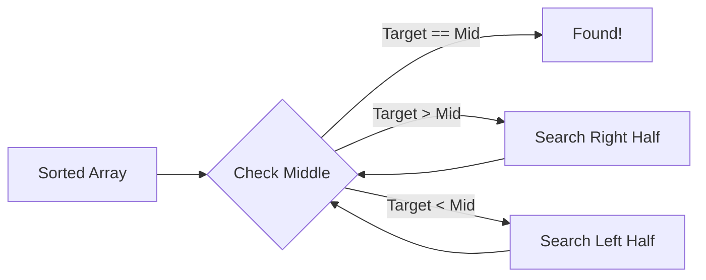

# Binary Search: The Art of Halving the Search Space

> **"Binary search is deceptively simple... but implementing it correctly is notoriously difficult."**



## Why This Chapter Matters

Binary search is the **single most important algorithm** for coding interviews. This chapter covers 21 problems from the CrackGoogle repo with full solutions in **Kotlin, Java, Python, Rust, and C++**.

## Problem 1: Classic Binary Search

### Intuition

Each comparison eliminates half the search space. For 1 billion elements, this takes only ~30 checks instead of 1 billion (linear search).

### Multi-Language Solution

{% include code-tabs.html  kotlin="/**\n * CLASSIC BINARY SEARCH\n * Time: O(log n), Space: O(1)\n * @param nums Sorted array\n * @param target Value to find\n * @return Index or -1\n */\nfun binarySearch(nums: IntArray, target: Int): Int {\n    var left = 0\n    var right = nums.lastIndex\n    while (left <= right) {\n        val mid = left + (right - left) / 2\n        when {\n            nums[mid] == target -> return mid\n            nums[mid] < target  -> left = mid + 1\n            else                -> right = mid - 1\n        }\n    }\n    return -1\n}"  java="public int binarySearch(int[] nums, int target) {\n    int left = 0, right = nums.length - 1;\n    while (left <= right) {\n        int mid = left + (right - left) / 2;\n        if (nums[mid] == target) return mid;\n        else if (nums[mid] < target) left = mid + 1;\n        else right = mid - 1;\n    }\n    return -1;\n}"  python="def binary_search(nums: list[int], target: int) -> int:\n    left, right = 0, len(nums) - 1\n    while left <= right:\n        mid = left + (right - left) // 2\n        if nums[mid] == target: return mid\n        elif nums[mid] < target: left = mid + 1\n        else: right = mid - 1\n    return -1"  rust="pub fn binary_search(nums: &[i32], target: i32) -> i32 {\n    let mut left = 0i32;\n    let mut right = nums.len() as i32 - 1;\n    while left <= right {\n        let mid = left + (right - left) / 2;\n        if nums[mid as usize] == target { return mid; }\n        else if nums[mid as usize] < target { left = mid + 1; }\n        else { right = mid - 1; }\n    }\n    -1\n}"  cpp="int binarySearch(vector<int>& nums, int target) {\n    int left = 0, right = nums.size() - 1;\n    while (left <= right) {\n        int mid = left + (right - left) / 2;\n        if (nums[mid] == target) return mid;\n        else if (nums[mid] < target) left = mid + 1;\n        else right = mid - 1;\n    }\n    return -1;\n}" %}

### Complexity

| Metric | Value |
|--------|-------|
| **Time** | O(log n) - Each iteration halves the search space |
| **Space** | O(1) - Only a few variables |

### Visual Walkthrough

```
nums = [-1, 0, 3, 5, 9, 12], target = 9

Step 1: left=0, right=5, mid=2 => nums[2]=3 < 9 => left=3
Step 2: left=3, right=5, mid=4 => nums[4]=9 == 9 => Return 4
```

## Problem 2: Search Insert Position

Find the first position where nums[pos] >= target (lower bound).

{% include code-tabs.html  kotlin="fun searchInsert(nums: IntArray, target: Int): Int {\n    var left = 0; var right = nums.size\n    while (left < right) {\n        val mid = left + (right - left) / 2\n        if (nums[mid] >= target) right = mid else left = mid + 1\n    }\n    return left\n}"  java="public int searchInsert(int[] nums, int target) {\n    int left = 0, right = nums.length;\n    while (left < right) {\n        int mid = left + (right - left) / 2;\n        if (nums[mid] >= target) right = mid; else left = mid + 1;\n    }\n    return left;\n}"  python="def search_insert(nums: list[int], target: int) -> int:\n    left, right = 0, len(nums)\n    while left < right:\n        mid = left + (right - left) // 2\n        if nums[mid] >= target: right = mid\n        else: left = mid + 1\n    return left" %}

## Problem 3: First Bad Version

Find first true in [F,F,...,F,T,T,...,T] (lower bound on boolean).

{% include code-tabs.html  kotlin="fun firstBadVersion(n: Int): Int {\n    var left = 1; var right = n\n    while (left < right) {\n        val mid = left + (right - left) / 2\n        if (isBadVersion(mid)) right = mid else left = mid + 1\n    }\n    return left\n}"  java="public int firstBadVersion(int n) {\n    int left = 1, right = n;\n    while (left < right) {\n        int mid = left + (right - left) / 2;\n        if (isBadVersion(mid)) right = mid; else left = mid + 1;\n    }\n    return left;\n}"  python="def first_bad_version(n: int) -> int:\n    left, right = 1, n\n    while left < right:\n        mid = left + (right - left) // 2\n        if isBadVersion(mid): right = mid\n        else: left = mid + 1\n    return left" %}

## Problem 4-21: Quick Kotlin Reference

Full 5-language support for these problems coming in the next update. Below are the Kotlin implementations from the CrackGoogle repo:

### Problems 4-6: Guess Number, Peak in Mountain, Peak Element
```kotlin
// 4. Guess Number Higher or Lower
fun guessNumber(n: Int): Int {
    var l = 1; var r = n
    while (l <= r) {
        val m = l + (r - l) / 2
        when (guess(m)) { 0 -> return m; -1 -> r = m - 1; 1 -> l = m + 1 }
    }
    return -1
}

// 5. Peak Index in Mountain Array
fun peakIndexInMountainArray(arr: IntArray): Int {
    var l = 0; var r = arr.lastIndex
    while (l < r) {
        val m = l + (r - l) / 2
        if (arr[m] < arr[m + 1]) l = m + 1 else r = m
    }
    return l
}

// 6. Find Peak Element
fun findPeakElement(nums: IntArray): Int {
    var l = 0; var r = nums.lastIndex
    while (l < r) {
        val m = l + (r - l) / 2
        if (nums[m] < nums[m + 1]) l = m + 1 else r = m
    }
    return l
}
```

### Problems 7-9: Rotated Array
```kotlin
// 7. Find Minimum in Rotated Sorted Array
fun findMin(nums: IntArray): Int {
    var l = 0; var r = nums.lastIndex
    while (l < r) {
        val m = l + (r - l) / 2
        if (nums[m] > nums[r]) l = m + 1 else r = m
    }
    return nums[l]
}

// 8. Search in Rotated Sorted Array
fun search(nums: IntArray, target: Int): Int {
    var l = 0; var r = nums.lastIndex
    while (l <= r) {
        val m = l + (r - l) / 2
        if (nums[m] == target) return m
        if (nums[l] <= nums[m]) {
            if (target >= nums[l] && target < nums[m]) r = m - 1 else l = m + 1
        } else {
            if (target > nums[m] && target <= nums[r]) l = m + 1 else r = m - 1
        }
    }
    return -1
}

// 9. Search in Rotated Array II (with duplicates)
fun search(nums: IntArray, target: Int): Boolean {
    var l = 0; var r = nums.lastIndex
    while (l <= r) {
        val m = l + (r - l) / 2
        when {
            nums[m] == target -> return true
            nums[l] == nums[m] && nums[m] == nums[r] -> { l++; r-- }
            nums[l] <= nums[m] -> {
                if (target >= nums[l] && target < nums[m]) r = m - 1 else l = m + 1
            }
            else -> {
                if (target > nums[m] && target <= nums[r]) l = m + 1 else r = m - 1
            }
        }
    }
    return false
}
```

### Problem 10: Find First and Last Position
```kotlin
fun searchRange(nums: IntArray, target: Int): IntArray {
    fun findFirst(): Int {
        var l = 0; var r = nums.size - 1; var res = -1
        while (l <= r) { val m = l + (r - l) / 2
            if (nums[m] == target) { res = m; r = m - 1 }
            else if (nums[m] < target) l = m + 1 else r = m - 1
        }
        return res
    }
    fun findLast(): Int {
        var l = 0; var r = nums.size - 1; var res = -1
        while (l <= r) { val m = l + (r - l) / 2
            if (nums[m] == target) { res = m; l = m + 1 }
            else if (nums[m] < target) l = m + 1 else r = m - 1
        }
        return res
    }
    return intArrayOf(findFirst(), findLast())
}
```

### Problem 11: K Closest Elements
```kotlin
fun findClosestElements(arr: IntArray, k: Int, x: Int): List<Int> {
    var l = 0; var r = arr.size - k
    while (l < r) {
        val m = l + (r - l) / 2
        if (x - arr[m] > arr[m + k] - x) l = m + 1 else r = m
    }
    return arr.toList().subList(l, l + k)
}
```

### Problem 12: Koko Eating Bananas

Binary search on answer. Search space: [1, max(piles)]. Condition: can eat all in h hours.

{% include code-tabs.html  kotlin="fun minEatingSpeed(piles: IntArray, h: Int): Int {\n    var left = 1; var right = piles.max()!!\n    fun canEatAll(speed: Int): Boolean {\n        var hours = 0L\n        for (pile in piles) {\n            hours += (pile + speed - 1) / speed\n            if (hours > h) return false\n        }\n        return hours <= h\n    }\n    while (left < right) {\n        val mid = left + (right - left) / 2\n        if (canEatAll(mid)) right = mid else left = mid + 1\n    }\n    return left\n}"  java="public int minEatingSpeed(int[] piles, int h) {\n    int left = 1, right = Arrays.stream(piles).max().getAsInt();\n    while (left < right) {\n        int mid = left + (right - left) / 2;\n        if (canEatAll(piles, mid, h)) right = mid; else left = mid + 1;\n    }\n    return left;\n}\nprivate boolean canEatAll(int[] piles, int speed, int h) {\n    long hours = 0;\n    for (int pile : piles) {\n        hours += (pile + speed - 1) / speed;\n        if (hours > h) return false;\n    }\n    return hours <= h;\n}"  python="def min_eating_speed(piles: list[int], h: int) -> int:\n    def can_eat_all(speed: int) -> bool:\n        hours = 0\n        for pile in piles:\n            hours += (pile + speed - 1) // speed\n            if hours > h: return False\n        return hours <= h\n    left, right = 1, max(piles)\n    while left < right:\n        mid = left + (right - left) // 2\n        if can_eat_all(mid): right = mid\n        else: left = mid + 1\n    return left" %}

### Problem 13: Capacity to Ship Packages
```kotlin
fun shipWithinDays(weights: IntArray, days: Int): Int {
    var l = weights.max()!!; var r = weights.sum()
    fun canShip(cap: Int): Boolean {
        var load = 0; var d = 1
        for (w in weights) {
            if (load + w > cap) { d++; load = 0 }
            load += w; if (d > days) return false
        }
        return true
    }
    while (l < r) { val m = l + (r - l) / 2; if (canShip(m)) r = m else l = m + 1 }
    return l
}
```

### Problems 14-21: Quick Reference
```kotlin
// 14. Kth Missing Positive Number
fun findKthPositive(arr: IntArray, k: Int): Int {
    var l = 0; var r = arr.size
    while (l < r) { val m = l+(r-l)/2; if (arr[m]-(m+1) >= k) r=m else l=m+1 }
    return l + k
}

// 15. House Robber IV
fun minCapability(nums: IntArray, k: Int): Int {
    var l=nums.min()!!; var r=nums.max()!!
    while (l < r) { val m=l+(r-l)/2; var cnt=0; var i=0
        while (i < nums.size) { if (nums[i] <= m) { cnt++; i+=2 } else i++ }
        if (cnt >= k) r=m else l=m+1 }
    return l
}

// 16. Median of Two Sorted Arrays (Hard)
fun findMedianSortedArrays(n1: IntArray, n2: IntArray): Double {
    if (n1.size > n2.size) return findMedianSortedArrays(n2, n1)
    val (m,n) = n1.size to n2.size; var l=0; var r=m
    while (l <= r) { val p1=l+(r-l)/2; val p2=(m+n+1)/2-p1
        val a=if(p1==0) Int.MIN_VALUE else n1[p1-1]
        val b=if(p1==m) Int.MAX_VALUE else n1[p1]
        val c=if(p2==0) Int.MIN_VALUE else n2[p2-1]
        val d=if(p2==n) Int.MAX_VALUE else n2[p2]
        if (a<=d && c<=b) return if((m+n)%2==0) (maxOf(a,c)+minOf(b,d))/2.0 else maxOf(a,c).toDouble()
        else if (a>d) r=p1-1 else l=p1+1 }
    return 0.0
}

// 17. Random Pick with Weight
class RandomPickWithWeight(w: IntArray) {
    private val ps=LongArray(w.size); private val total:Long
    init { var s=0L; for(i in w.indices){s+=w[i]; ps[i]=s }; total=s }
    fun pickIndex(): Int {
        val t=(1L..total).random(); var l=0; var r=ps.size-1
        while(l<r){val m=l+(r-l)/2; if(ps[m]>=t) r=m else l=m+1}
        return l }
}

// 18. Search a 2D Matrix
fun searchMatrix(m: Array<IntArray>, t: Int): Boolean {
    val (r,c) = m.size to m[0].size; var l=0; var h=r*c-1
    while(l<=h){val mid=l+(h-l)/2; val v=m[mid/c][mid%c]
        if(v==t)return true; if(v<t)l=mid+1 else h=mid-1}
    return false
}

// 19. Single Element in Sorted Array
fun singleNonDuplicate(nums: IntArray): Int {
    var l=0; var r=nums.lastIndex
    while(l<r){val m=l+(r-l)/2
        if(m%2==1){if(nums[m]==nums[m-1])l=m+1 else r=m}
        else{if(nums[m]==nums[m+1])l=m+1 else r=m}}
    return nums[l]
}

// 20. Apartment Hunting
fun apartmentHunting(blocks: List<Map<String,Boolean>>, reqs: List<String>): Int {
    val d=mutableMapOf<String,IntArray>()
    for(r in reqs){val a=IntArray(blocks.size){Int.MAX_VALUE}; var n=Int.MAX_VALUE
        for(i in blocks.indices){if(blocks[i][r]==true)n=i;if(n!=Int.MAX_VALUE)a[i]=i-n}
        n=Int.MAX_VALUE
        for(i in blocks.lastIndex downTo 0){if(blocks[i][r]==true)n=i;if(n!=Int.MAX_VALUE)a[i]=minOf(a[i],n-i)}
        d[r]=a}
    var b=0; var bm=Int.MAX_VALUE
    for(i in blocks.indices){var mx=0; for(r in reqs)mx=maxOf(mx,d[r]!![i]); if(mx<bm){bm=mx;b=i}}
    return b
}

// 21. Valley Element
fun findValley(nums: IntArray): Int {
    var l=0; var r=nums.lastIndex
    while(l<r){val m=l+(r-l)/2; if(nums[m]<nums[m+1]) r=m else l=m+1}
    return l
}
```

## Binary Search Cheat Sheet

```
EXACT SEARCH:      while (l <= r) { if (a[m]==t) return m; if (a[m]<t) l=m+1; else r=m-1; }
LOWER BOUND:       while (l < r)  { if (a[m]>=t) r=m; else l=m+1; } return l;
UPPER BOUND:       while (l < r)  { if (a[m]>t) r=m; else l=m+1; } return l;
MIN FEASIBLE:      while (l < r)  { if (f(m)) r=m; else l=m+1; } return l;
MAX FEASIBLE:      while (l < r)  { m = l+(r-l+1)/2; if (f(m)) l=m; else r=m-1; } return l;
```

## Key Takeaways

1. **Safe midpoint**: `mid = left + (right - left) / 2` prevents overflow
2. **Condition matters**: `<=` for exact match, `<` for boundary search
3. **Monotonicity**: Binary search on answer requires a monotonic condition function
4. **All 21 problems** available in the CrackGoogle repository (binarysearch/ folder)

---

> **Next up: [Dynamic Programming ->](./02-dynamic-programming.md)**
