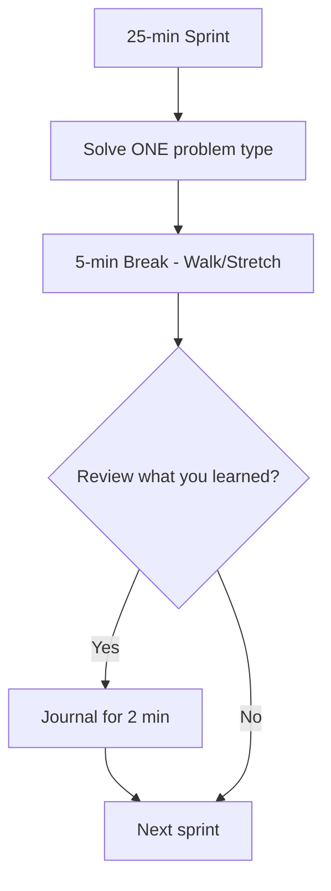
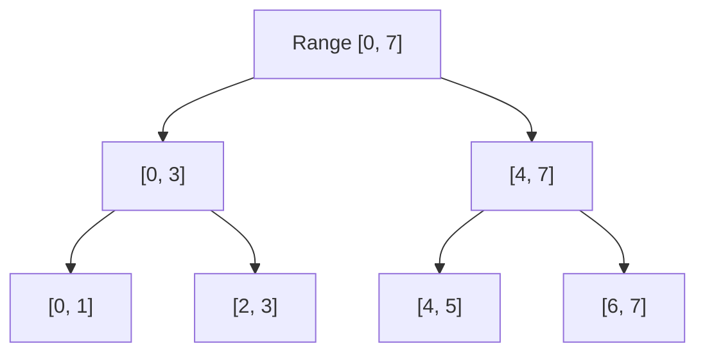
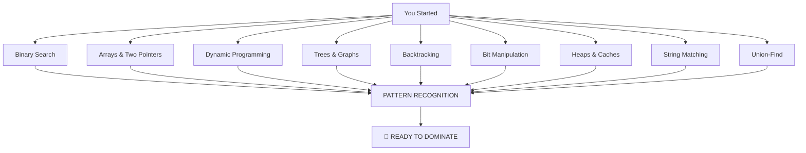

# 📚 Appendix: The Complete Gigachad Toolkit

> **"This is where we go beyond. The elite tier. The tools that separate L5/L6 engineers from the rest."**

---

## 🧠 The Neurodivergent Study Guide

### For Our ADHD Warriors 🎯



**Study Tips for ADHD**:
- 🎯 **Pomodoro**: 25 min study, 5 min break. Use a timer!
- 🎯 **One problem at a time**: Don't jump between topics
- 🎯 **Visual first**: Look at the diagram BEFORE reading the code
- 🎯 **Pattern journal**: Write down ONE pattern per day
- 🎯 **Body doubling**: Study with a friend or use a study-with-me video
- 🎯 **Movement**: Walk while thinking about a problem

### For Our Autistic Warriors 🧩

**Study Tips for Autism**:
- 🧩 **Consistent structure**: Every chapter follows the exact same format
- 🧩 **Detailed explanations**: Nothing is "left as an exercise"
- 🧩 **Pattern systems**: Learn the rules, then apply them systematically
- 🧩 **Special interest dive**: Deep-dive into ONE topic at a time
- 🧩 **Scripted responses**: Practice interview scripts:
  - *"Let me start by understanding the problem..."*
  - *"The brute force approach would be..."*
  - *"We can optimize this using..."*
  - *"Let me trace through an example..."*

### For Warriors with PTSD/Trauma 🛡️

**Study Tips for PTSD**:
- 🛡️ **Safe environment**: Study in your comfort space
- 🛡️ **No pressure**: There's no timeline. Go at YOUR pace
- 🛡️ **Rejection isn't personal**: Interview outcomes are random. Apply to MANY companies
- 🛡️ **Music**: Lo-fi, white noise, or silence — whatever works
- 🛡️ **Grounding technique**: If overwhelmed, name 5 things you can see, 4 you can touch...

### The Universal Truths

```
┌─────────────────────────────────────────────────────────────┐
│  You are NOT broken. Your brain works DIFFERENTLY.          │
│                                                             │
│  Hyperfocus → You can out-study anyone                      │
│  Pattern matching → You see connections others miss         │
│  Deep thinking → You understand things at a fundamental level│
│  Honesty → You say what others are afraid to say            │
│                                                             │
│  Your neurotype is your SUPERPOWER, not your weakness.      │
└─────────────────────────────────────────────────────────────┘
```

---

## 💎 The Elite Tier: Advanced Topics

### 1. Segment Tree with Lazy Propagation



**When to use**: Range queries + range updates (sum, min, max over a range)

**Key insight**: The tree has ~4n nodes. Updates and queries are O(log n).

### 2. Fenwick Tree (Binary Indexed Tree)

```
Fenwick Tree for prefix sums:
Index:  1  2  3  4  5  6  7  8
Value:  3  2  1  5  4  2  6  3
BIT:    3  5  1  11 4  6  6  26
         ↑     ↑           ↑
        [1]   [1-4]       [1-8]
```

**When to use**: Prefix sum queries + point updates. Simpler than segment tree but less powerful.

### 3. Binary Lifting (LCA)

**The concept**: Precompute `up[v][k]` = the 2^k-th ancestor of node v.

```
For each node v:
  up[v][0] = parent[v]
  up[v][1] = up[up[v][0]][0] = grandparent
  up[v][2] = up[up[v][1]][1] = great-grandparent
  ...
```

**Use case**: Find Lowest Common Ancestor in O(log n), path queries in trees.

### 4. Bitwise Trie (Maximum XOR)

```
Binary Trie for maximum XOR:
        root
       /    \
      0      1
     / \    / \
    0   1  0   1
   /   /  /     \
  0   1  0       1
```

**Use case**: Maximum XOR of two numbers in O(n log MAX).

### 5. Aho-Corasick (Multi-pattern Matching)

**The concept**: Trie + KMP failure links = find ALL patterns in O(n + total pattern length).

```
Text: "bananas"
Patterns: ["ana", "ban", "nas"]
Result: "ban" at 0, "ana" at 1, "ana" at 3, "nas" at 4
```

---

## 📊 The Complete LeetCode Problem Index

### By Topic (Must-Solve Problems)

| Topic | Must-Solve | LeetCode Links |
|-------|-----------|----------------|
| **Binary Search** | Classic, First Bad Version, Koko, Ship Within Days | 704, 278, 875, 1011 |
| **DP** | Climbing Stairs, Coin Change, LCS, Edit Distance | 70, 322, 1143, 72 |
| **Arrays** | Two Sum II, Three Sum, Container Water, Rain Water | 167, 15, 11, 42 |
| **Linked Lists** | Reverse, Cycle, Merge, Remove Nth | 206, 141, 21, 19 |
| **Trees** | Max Depth, Validate BST, Level Order, LCA | 104, 98, 102, 236 |
| **Graphs** | Clone Graph, Islands, Course Schedule, Dijkstra | 133, 200, 207, 743 |
| **Backtracking** | Subsets, Permutations, N-Queens, Sudoku | 78, 46, 51, 37 |
| **Heaps** | Kth Largest, Top K Frequent, Median Stream | 215, 347, 295 |
| **Bit Manip** | Single Number, Hamming Weight, Reverse Bits | 136, 191, 190 |
| **String** | KMP, Rabin-Karp, Longest Substring Without Repeat | 28, 3 |
| **Caches** | LRU Cache, LFU Cache | 146, 460 |
| **Union-Find** | Connected Components, Account Merge | 323, 721 |

### By Difficulty

| Difficulty | Problems |
|-----------|----------|
| 🟢 **Easy (15)** | Binary Search 704, First Bad Version 278, Climbing Stairs 70, Max Depth 104, Invert Tree 226, Reverse Linked List 206, Merge Lists 21, Two Sum II 167, Move Zeroes 283, Single Number 136, Hamming Weight 191, Power of Two 231, Valid Parentheses 20, Contains Duplicate 217, Missing Number 268 |
| 🟠 **Medium (25)** | Three Sum 15, Container Water 11, K Closest 658, Koko 875, Coin Change 322, LCS 1143, House Robber 198, Number of Islands 200, Clone Graph 133, Course Schedule 207, Validate BST 98, Level Order 102, Kth Largest 215, Top K Frequent 347, Subsets 78, Permutations 46, Combination Sum 39, Single Number III 260, LRU Cache 146, Rotate Array 189 |
| 🔴 **Hard (10)** | Trapping Rain Water 42, Edit Distance 72, N-Queens 51, Sudoku Solver 37, Median Stream 295, Word Ladder 127, LFU Cache 460, Merge K Sorted Lists 23, Serialize Tree 297, Maximum Path Sum 124 |

---

## 🚀 System Design Mini-Reference

### The 5-Step System Design Framework

```
┌─────────────────────────────────────────────────────────────┐
│  1. REQUIREMENTS                                            │
│     Functional: What does the system do?                    │
│     Non-functional: Scale, latency, availability            │
│                                                             │
│  2. ESTIMATIONS                                             │
│     DAU, QPS, storage, bandwidth                            │
│                                                             │
│  3. DATA MODEL                                              │
│     Schema, storage choice (SQL vs NoSQL)                   │
│                                                             │
│  4. HIGH-LEVEL DESIGN                                       │
│     Components, data flow, API design                       │
│                                                             │
│  5. DEEP DIVE                                               │
│     Caching, sharding, consistency, fault tolerance         │
└─────────────────────────────────────────────────────────────┘
```

### Key Numbers to Know

```
┌─────────────────────────────────────────────────────────────┐
│  MEMORY                                                     │
│  ────────────────────────────────────────────────           │
│  1 byte          = 8 bits                                   │
│  1 KB            = 1,000 bytes                              │
│  1 MB            = 1,000 KB ≈ 1 million bytes              │
│  1 GB            = 1,000 MB ≈ 1 billion bytes              │
│                                                             │
│  LATENCY NUMBERS                                            │
│  ────────────────────────────────────────────────           │
│  L1 cache       = 1 ns                                      │
│  L2 cache       = 10 ns                                     │
│  RAM            = 100 ns                                    │
│  SSD            = 100 μs                                    │
│  Network call   = 1-100 ms                                  │
│                                                             │
│  SCALE                                                        │
│  ────────────────────────────────────────────────           │
│  1 million req/day  ≈ 12 req/sec                            │
│  10 million req/day ≈ 120 req/sec                           │
│  100 million req/day≈ 1,200 req/sec                          │
│  1 billion req/day  ≈ 12,000 req/sec                         │
│                                                             │
└─────────────────────────────────────────────────────────────┘
```

---

## 💰 TC or GTFO: Compensation Strategies

### Level Expectations

| Company | E3/L3 (New Grad) | E4/L4 (Mid) | E5/L5 (Senior) | E6/L6 (Staff) |
|---------|-----------------|-------------|----------------|---------------|
| Google  | $180-220K       | $250-350K   | $400-550K      | $600-900K+    |
| Meta    | $170-210K       | $300-400K   | $500-700K      | $800K-1.2M+   |
| Amazon  | $140-180K       | $200-300K   | $350-500K      | $500-800K+    |
| Netflix | -               | $250-500K   | $400-700K      | $600-1M+      |
| Apple   | $150-200K       | $250-350K   | $400-550K      | $600-900K+    |

### Negotiation Tips

1. **Get multiple offers**: You can't negotiate without leverage
2. **Don't give the first number**: Let them name the range
3. **Focus on TC, not base**: RSUs and bonuses compound
4. **The "I really want to join but..." script**:
   > *"I'm really excited about [Company] and the team. The offer is good, but I have another offer from [Competitor] for [X]. If you can match at [Y], I'll sign today."*
5. **Stock appreciation**: At companies like Meta/Google, stocks can double in 4 years

---

## 📖 Final Words

> **"The difference between landing a top-tier role and not is often measured in hundreds of thousands of dollars. This document exists to treat that gap with the gravity it deserves."**

### What You've Learned



### The Fight Club Creed

> **"We don't complain about the game. We learn the rules. We master them. And we win."**

---

**Now go get that bag. 🥊💰**

---

*[Back to Home →](../index.md)*
