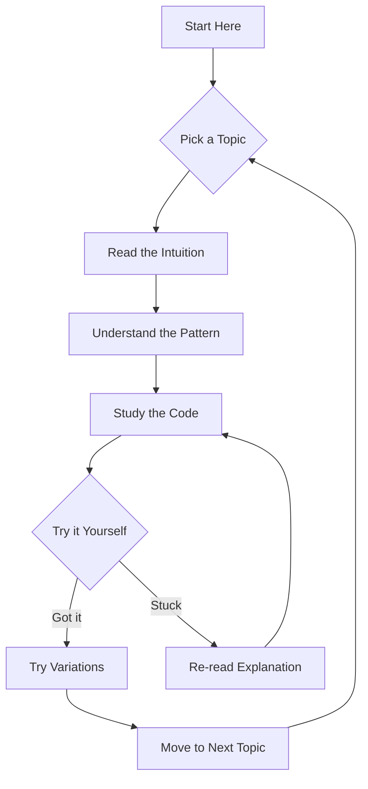

# 🥊 Coding Interview Fight Club

## Your Ultimate Survival Guide & Training Regimen

> **"Everything we do in the computer is an algorithm which requires some data structures."**

This book is your **complete, unflinching guide** to dominating the modern software engineering interview process. Born from thousands of successful (and unsuccessful) interview cycles at top-tier tech companies—Google, Meta, Amazon, Netflix, and beyond.

This isn't just another LeetCode grind guide. This is a **fight club**. We train like warriors. We think like champions. We escape poverty through algorithms.

---

## 🎯 Why This Book Exists

| Reason | Reality |
|--------|---------|
| **High Stakes** | The difference between landing a top-tier role and not is often measured in **hundreds of thousands of dollars** (TC or GTFO) |
| **The Bar is High** | Companies have inflated interview difficulty. We meet and exceed that bar |
| **Efficiency** | No aimless grinding. We focus on **pattern-based knowledge** with highest ROI |

## 🧠 For the Neurodivergent Warrior

This book is designed with **you** in mind. Whether you navigate ADHD, Autism, PTSD, or any other neurotype:

- ✅ **Visual explanations** - Diagrams, flowcharts, visual patterns
- ✅ **Consistent structure** - Every problem follows the same predictable format
- ✅ **Detailed build-up** - We start from brute force and **gradually** optimize
- ✅ **No assumption gaps** - Everything is explained. Nothing is "left as an exercise"
- ✅ **Multi-language tabs** - See solutions in Kotlin, Java, Python, Rust, and C++
- ✅ **Pattern recognition** - Learn to spot the solution in 2 minutes

## 📚 What You'll Master

| # | Topic | Problems Covered | Difficulty |
|---|-------|-----------------|------------|
| [1](./chapters/01-binary-search) | **Binary Search** | 20+ problems | 🟢🟠🔴 |
| [2](./chapters/02-dynamic-programming) | **Dynamic Programming** | 30+ problems | 🟢🟠🔴 |
| [3](./chapters/03-arrays-two-pointers) | **Arrays & Two Pointers** | 30+ problems | 🟢🟠🔴 |
| [4](./chapters/04-linked-lists) | **Linked Lists** | 15+ problems | 🟢🟠🔴 |
| [5](./chapters/05-trees) | **Trees** | 30+ problems | 🟢🟠🔴 |
| [6](./chapters/06-graphs) | **Graphs** | 20+ problems | 🟢🟠🔴 |
| [7](./chapters/07-bit-manipulation) | **Bit Manipulation** | 10+ problems | 🟢🟠🔴 |
| [8](./chapters/08-heaps) | **Heaps & Priority Queues** | 10+ problems | 🟢🟠🔴 |
| [9](./chapters/09-disjoint-set-union) | **Disjoint Set Union** | 10+ problems | 🟢🟠🔴 |
| [10](./chapters/10-string-matching) | **String Matching** | 10+ problems | 🟢🟠🔴 |
| [11](./chapters/11-backtracking) | **Backtracking** | 15+ problems | 🟢🟠🔴 |
| [12](./chapters/12-caches) | **Caches & Memory Mgmt** | 5+ problems | 🟠🔴 |
| [A](./chapters/13-appendix) | **Appendix & Toolkit** | Reference & Index | - |

## 🏗️ Structure of Each Chapter

```
┌─────────────────────────────────────────────┐
│  🎯 PROBLEM STATEMENT                        │
│  What we're solving, clearly defined         │
├─────────────────────────────────────────────┤
│  💡 INTUITION & PATTERN                      │
│  The "aha!" moment explained visually        │
├─────────────────────────────────────────────┤
│  🔨 BRUTE FORCE → OPTIMIZED                  │
│  We build up, never skip steps               │
├─────────────────────────────────────────────┤
│  📝 CODE (Multi-language tabs)               │
│  Kotlin │ Java │ Python │ Rust │ C++         │
├─────────────────────────────────────────────┤
│  ⏱️ COMPLEXITY ANALYSIS                      │
│  Time & Space, why it works                  │
├─────────────────────────────────────────────┤
│  🧪 VARIATIONS & FOLLOW-UPS                  │
│  What the interviewer asks next              │
└─────────────────────────────────────────────┘
```

## 🚀 How to Use This Book



## 🗺️ Suggested Learning Paths

### 🟢 Beginner (0-3 months)
Binary Search → Arrays → Linked Lists → Trees → Hash Tables → Heaps

### 🔵 Intermediate (3-6 months)
Dynamic Programming → Graphs → Greedy → Backtracking → Sliding Window

### 🔴 Advanced (6-12 months)
Advanced Graphs → String Matching → Segment Trees → Geometry → System Design

---

## 👊 The Fight Club Creed

> **"The modern tech interview is less about finding a competent coder and more about passing a highly standardized, artificial test. We don't complain about the game. We learn the rules. We master them. And we win."**

**Let's begin.**

---

[📖 Start Reading →](./chapters/01-binary-search.md)
